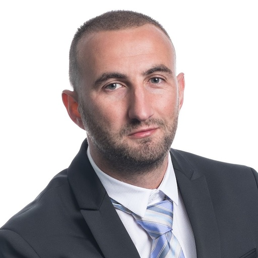
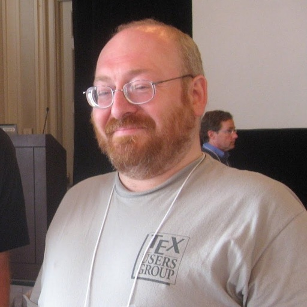

# The Martians

MARS is nothing without Martians. Here are our dedicated team of core maintainers, ordered by join date.

## Sam Schwartz, PhD

* Join Date: March 30, 2025
* GitHub Handle: [samuel-schwartz](https://github.com/samuel-schwartz)
* Email Address: samuel.d.schwartz@gmail.com
* Day Job: Professor in the Universities of Wisconsin System
* Located In: Wisconsin, USA

## Anthony Dario

* Join Date: March 30, 2025
* GitHub Handle: [AnthonyDario](https://github.com/AnthonyDario)
* Day Job: PhD candidate, University of Oregon
* Located In: Oregon, USA

## Guy Pavlov

* Join Date: March 31, 2025
* GitHub Handle: [gpavlov2016](https://github.com/gpavlov2016)
* Day Job: 20+ years as a {AI Freelancer, Engineering Manager, Startup Cofounder}
* Located In: Ontario, Canada

## Boris Veytsman, PhD

* Join Date: April 7, 2025
* GitHub Handle: [borisveytsman](https://github.com/borisveytsman)
* Day Job: Researcher at the Chan Zuckerberg Initiative and George Mason University
* Located In: California, USA / greater Washington DC area, USA
